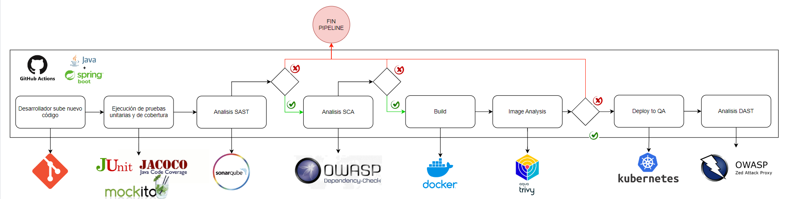

# Proyecto de Gestión de Horas Médicas

Este proyecto es una aplicación de gestión de horas médicas desarrollada con Java Spring Boot. Incluye un pipeline DevSecOps implementado con GitHub Actions, que automatiza el proceso de integración continua, entrega continua y seguridad continua.

La lógica de negocio de la aplicación es simple, pero se implementa un conjunto de buenas prácticas de desarrollo de software que mejoran la calidad, mantenibilidad y seguridad del código.


Aún se está trabajando sobre este repositorio.

## Estructura del Proyecto

```
medical-hour-management/
│
├── .github/
│   └── workflows/
│       └── main.yml
│
├── src/
│   └── main/
│      ├── java/com/medicalhourmanagement/
│      │   ├── configs/
│      │   ├── controllers/
│      │   ├── dtos/
│      │   │   ├── request/
│      │   │   └── response/
│      │   ├── entities/
│      │   ├── exceptions/
│      │   ├── repositories/
│      │   ├── security/
│      │   │   ├── filter/
│      │   │   └── service/
│      │   ├── services/
│      │   │   └── impl/
│      │   ├── utils/
│      │   │   ├── constant/
│      │   │   ├── enums/
│      │   │   └── validator/
│      │   └── MedicalHourManagementApplication.java
│      │
│      └── resources/
│          ├── application.properties
│          ├── application-dev.properties
│          ├── application-prod.properties
│   
├── .gitignore
├── mvnw
├── mvnw.cmd
├── pom.xml
└── README.md
```

## Principales Componentes

- `security/`: Contiene las clases relacionadas con la autenticación y seguridad.
- `configs/`: Configuraciones generales de la aplicación.
- `constants/`: Constantes utilizadas en todo el proyecto.
- `controllers/`: Controladores REST que manejan las solicitudes HTTP.
- `dtos/`: Objetos de Transferencia de Datos (DTOs) para la comunicación entre capas.
- `entities/`: Entidades JPA que representan las tablas de la base de datos.
- `enums/`: Enumeraciones utilizadas en el proyecto.
- `exceptions/`: Manejo centralizado de excepciones.
- `repositories/`: Interfaces de repositorio para el acceso a datos.
- `services/`: Servicios que contienen la lógica de negocio.

## Pipeline DevSecOps

El proyecto incluye un pipeline de DevSecOps implementado con GitHub Actions. Este pipeline automatiza varios aspectos del desarrollo, pruebas y despliegue, incluyendo:

- Compilación y pruebas unitarias
- Análisis de código estático (SAST) con SonarCloud
- Análisis de composición de software (SCA)
- Construcción y escaneo de imágenes Docker
- Pruebas de seguridad de aplicaciones dinámicas (DAST)
- Despliegue automatizado en un cluster de Kubernetes

El pipeline está configurado en el archivo `.github/workflows/main.yml`.

### Diagrama del Pipeline


Este diagrama muestra el flujo completo del pipeline, desde que el desarrollador sube el código hasta el despliegue en producción, pasando por todas las etapas de seguridad y calidad.

## Detalles del Pipeline DevSecOps

En aquellos pasos que consideran detención del pipeline se está bypasseando la detención para facilitar el desarrollo.

### SAST (Static Application Security Testing)
- Utiliza SonarCloud para el análisis de código estático.
- Se configuró un Quality Profile personalizado para detectar solo vulnerabilidades con un nivel de severidad específico.
- El Quality Gate se configuró para detener el pipeline basado en estas vulnerabilidades.

### SCA (Software Composition Analysis)
- Utiliza Dependency Check (action: dependency-check/Dependency-Check_Action@main).
- Genera reportes en formato SARIF para su visualización en la pestaña de Seguridad de GitHub.
- Configurado para detener el pipeline ante vulnerabilidades de severidad media o superior (CVSS >= 4).

### Análisis de Imagen
- Utiliza Trivy para escanear las imágenes Docker.
- Genera reportes en formato SARIF.
- Se implementó un paso adicional para contar las vulnerabilidades y detener el pipeline si se encuentran vulnerabilidades Medias, Altas o Críticas.

### DAST (Dynamic Application Security Testing)
- Utiliza OWASP ZAP (action: zaproxy/action-baseline@v0.12.0).
- Genera reportes en formatos HTML, Markdown y JSON.
- Los resultados se suben automáticamente a la pestaña de Issues del repositorio en GitHub.


## Buenas Prácticas Implementadas

En este apartado se mencionan y detallan algunas de las buenas prácticas que he aprendido a lo largo de mi experiencia en desarrollo y que están implementadas en este proyecto.

### 1. Arquitectura en Capas

Se separan las responsabilidades del sistema en capas distintas (como controladores, servicios, repositorios, etc).

**Impacto:** Mejora la modularidad, facilita el mantenimiento y permite cambios en una capa sin afectar a las demás.

**Ejemplo:**
```java
@RestController
@RequestMapping(EndpointsConstants.ENDPOINT_APPOINTMENTS)
public class AppointmentController {
    private final AppointmentService appointmentService;
    // ...
}

@Service
public class AppointmentServiceImpl implements AppointmentService {
    private final AppointmentRepository appointmentRepository;
    // ...
}
```

### 2. Implementación de Spring Security

Se usó Spring Security para la implementación de autenticación/autorización basada en roles.

**Impacto:** Protege el acceso a los distintos endpoints de la aplicación.

**Ejemplo:**
```java
@Configuration
@EnableWebSecurity
public class SecurityConfig {
    // ...
    @Bean
    public SecurityFilterChain securityFilterChain(HttpSecurity http) {
        // ...
    }
}
```

### 3. Implementación de Roles y Permisos

Se definen roles y permisos para permitir un control de acceso granular a diferentes endpoints de la aplicación.

**Impacto:** Mejora la seguridad al restringir el acceso basado en roles de usuario.

**Ejemplo:**
```java
public enum Role {
    USER(Collections.emptySet()),
    ADMIN(Set.of(ADMIN_READ, ADMIN_UPDATE, ADMIN_DELETE, ADMIN_CREATE)),
    // ...
}
``` 

### 4. Control de Acceso Basado en Roles a Nivel de Método

Se usa para implementar seguridad en múltiples capas, si bien el securityFilterChain restringe a nivel de URL también se usa seguridad a nivel de método.

**Impacto:** Mejora la seguridad del código.

**Ejemplo:**
```java
@PreAuthorize("hasRole('" + RoleConstants.ROLE_ADMIN + "')")
public PatientDTO updatePatient(@NonNull final Long patientId, @NonNull final PatientDTO patientDTO) {
    // ...
}
```

### 5. Uso de DTOs (Data Transfer Objects)

Para mover la información entre las distintas capas, en lugar de usar la entidad directamente se implementa un DTO, que es un objeto simple que se usa netamente para transferir datos.

**Impacto:** Mejora la seguridad al no exponer cualquier información innecesaria.

**Ejemplo:**
```java
public class AppointmentDTO {
    private Long id;
    private DoctorDTO doctor;
    private PatientDTO patient;
    private LocalDateTime date;
    // ...
}
```

### 6. Validaciones de Entrada

Se usa para asegurar que los datos de entrada cumplan con los requisitos de seguridad y negocio antes de ser procesados.

**Impacto:** Previene errores y vulnerabilidades de seguridad, como por ejemplo inyecciones SQL.

**Ejemplo:**
```java
public class RegisterRequestDTO {
    @PasswordConstraint
    private String password;
    // ...
}
```

### 7. Manejo de Excepciones Centralizado

Se usa un @RestControllerAdvice , que proporciona un punto central para manejar las excepciones.

**Impacto:** Mejora la consistencia en las respuestas de error y facilita el mantenimiento.

**Ejemplo:**
```java
@RestControllerAdvice
public class GlobalExceptionHandler {
    @ExceptionHandler(NotFoundException.class)
    public ResponseEntity<ExceptionDTO> handleNotFoundException(NotFoundException ex, WebRequest request) {
        // ...
    }
    // ...
}
```

### 8. Implementación de Interfaces para Servicios

Se crean interfaces para los servicios, lo que mejora abstracción y facilita futuras pruebas unitarias.

**Impacto:** Mejora la mantenibilidad y permite cambiar implementaciones fácilmente.

**Ejemplo:**
```java
public interface AppointmentService {
    List<AppointmentDTO> getAppointments();
    // ...
}

@Service
public class AppointmentServiceImpl implements AppointmentService {
    // ...
}
```

### 9. Uso de @Transactional

Se usa para asegurar la integridad de los datos en operaciones que realizan modifican la base de datos.

**Impacto:** Previene inconsistencias en los datos en caso de fallos durante las operaciones.

**Ejemplo:**
```java
@Transactional
public AppointmentDTO createAppointment(@NonNull final RequestAppointmentDTO requestAppointmentDTO) {
    // ...
}
```

### 10. Logging Adecuado

Se implementa logs en todas las funciones críticas.

**Impacto:** Facilita la depuración y el monitoreo del sistema.

**Ejemplo:**
```java
private static final Logger LOGGER = LoggerFactory.getLogger(AppointmentServiceImpl.class);

LOGGER.info("Creating appointment for patient {} with doctor {} at {}", patientId, doctorId, date);
```

En un ambiente productivo se debe ser cuidadoso con qué loggear, el logear excepciones sin normalizar o entregar atributos sensibles puede ser un regalo para cualquier atacante.

### 11. Configuración Externalizada con Variables de Entorno

Permite cambiar la configuración sin necesidad de modificar directamente el código.

**Impacto:** Mejora la seguridad y facilita el despliegue en diferentes entornos.

**Ejemplo:**
```properties
spring.datasource.url=${DATABASE_URL}
spring.datasource.username=${DATABASE_USERNAME}
spring.datasource.password=${DATABASE_PASSWORD}
```

### 12. Uso de Lombok

Es una libreria usada para reducir código repetitivo, propociona notaciones para getters, setters, constructores, etc.

**Impacto:** Mejora la legibilidad del código, reduce la probabilidad de errores y superficie de ataque.

**Ejemplo:**
```java
@Data
@Builder
@AllArgsConstructor
@NoArgsConstructor
public class AuthenticationResponseDTO {
    private String accessToken;
    private String refreshToken;
}
```

### 13. Uso de ModelMapper

Simplifica el mapeo entre objetos de diferentes capas.

**Impacto:** Reduce el código repetitivo y mejora la mantenibilidad.

**Ejemplo:**
```java
private DoctorDTO convertToRest(Doctor doctor) {
    return mapper.map(doctor, DoctorDTO.class);
}
```

### 14. Uso de Constantes

**Justificación:** Centraliza valores comunes y reduce errores por strings mal escritos.

**Impacto:** Mejora la mantenibilidad y reduce errores.

**Ejemplo:**
```java
public class ExceptionMessageConstants {
    public static final String USER_NOT_FOUND_MSG = "User not found";
    // ...
}
```

### 15. Uso de Enumeraciones

Se usan enums para todos los valores que representan Tipos.

**Impacto:** Reduce errores y mejora la legibilidad del código.

**Ejemplo:**
```java
public enum TokenType {
    BEARER
}
```

### 16. Uso de Swagger

Se usa swagger para documentar de manera automatizada los endpoints del proyecto.

**Impacto:** Facilita la documentación del proyecto.

**Ejemplo:**
```xml
<dependency>
<groupId>org.springdoc</groupId>
<artifactId>springdoc-openapi-starter-webmvc-ui</artifactId>
<version>2.1.0</version>
</dependency>
```

### 17. Aplicación de Principios de Clean Code

Se implementan principios de Clean Code a lo largo del proyecto, especialmente en la capa de servicio. Esto incluye métodos con responsabilidad única, nombres descriptivos, y una estructura clara y lógica del código. 

**Impacto:** Mejora significativamente la legibilidad, mantenibilidad y escalabilidad del código.

**Ejemplo:**

```java
@Service
@RequiredArgsConstructor
public class AppointmentServiceImpl implements AppointmentService {

    private final DoctorService doctorService;
    private final PatientService patientService;
    private final AppointmentRepository appointmentRepository;

    @Override
    @Transactional
    public AppointmentDTO createAppointment(@NonNull final RequestAppointmentDTO request) {
        Patient patient = getPatient(request.getPatient());
        Doctor doctor = getDoctor(request.getDoctor());

        validateUserAuthorization(patient);
        validateAppointmentTime(request.getDate(), doctor.getId(), patient.getId());

        Appointment appointment = buildAppointment(request.getDate(), doctor, patient);
        return saveAppointment(appointment);
    }

    private Patient getPatient(Long patientId) {
        return mapper.map(patientService.getPatientById(patientId), Patient.class);
    }

    private Doctor getDoctor(Long doctorId) {
        return mapper.map(doctorService.getDoctorById(doctorId), Doctor.class);
    }

    private void validateUserAuthorization(Patient patient) {
        // Lógica de validación
    }

    private void validateAppointmentTime(LocalDateTime date, Long doctorId, Long patientId) {
        // Lógica de validación de tiempo
    }

    private Appointment buildAppointment(LocalDateTime date, Doctor doctor, Patient patient) {
        // Construcción de la cita
    }

    private AppointmentDTO saveAppointment(Appointment appointment) {
        // Guardado y conversión a DTO
    }
}
```


## Pendiente por hacer:
- Se están implementando pruebas de rendimiento con JMeter, eso está casi completo, aún falta implementar el manejo del token en las solicitudes.

- Solucionar algunos problemas de seguridad identificados por las herramientas de seguridad.
